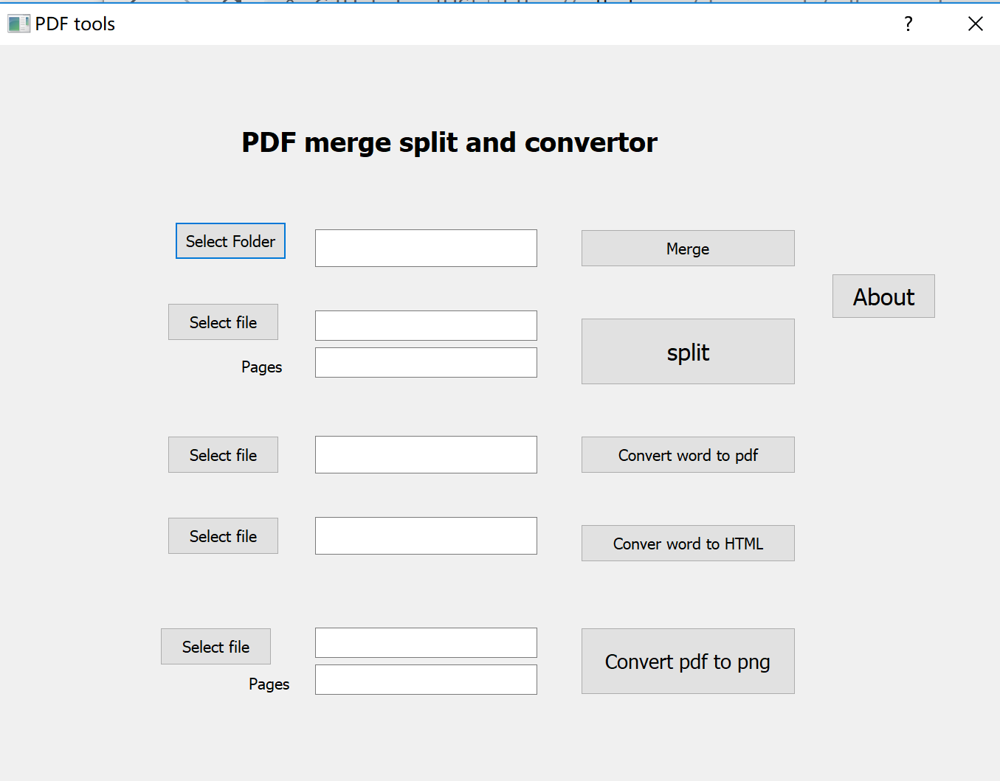

# pdf_convertor

pdf_convertor is a QT interface for converting different data format.

## Installation

Windows application. you need to install python.

interface: 

## Usage

## Contributing
Pull requests are welcome. For major changes, please open an issue first to discuss what you would like to change.

Please make sure to update tests as appropriate.

## License
[MIT](https://choosealicense.com/licenses/mit/)
